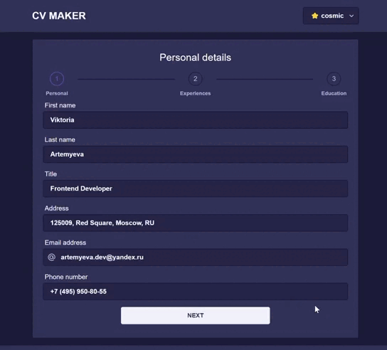

# cv-app

#### CV application for creating beautiful resume

#### 📑 Приложение для создания личного резюме (CV)

  

## Стек технологий
- Angular
- TypeScript
- HTML5
- SCSS
- NgRx
- RxJs
* [Nebular (UI Kit)](https://akveo.github.io/nebular/)
* [Bootstrap](https://getbootstrap.com)
* [jsPDF](https://github.com/parallax/jsPDF)
* [html2canvas](https://github.com/niklasvh/html2canvas)
* [eva-icons](https://akveo.github.io/eva-icons/#/)

## 🧐 Функционал
Приложение является конструктором резюме. Пользователю предлагается ввести персональные данные, данные об образовании и опыте работы.
После заполнения формы появляется возможность скачать резюме в формате pdf. 

В проекте продемонстрирована работа с реактивными формами, настроен обмен данными с Local Storage и сохранение данных в Store (NgRx). 
Реализована возможность выбора темы. 
Производится автосохранение полей на каждом этапе заполнения формы.

## 🚀 Демо
[Try now, not later](https://artemyevaviktoria.github.io/cv-app/) 

## Установка зависимостей
`npm install`

## Запуск проекта на локальном сервере
`ng serve`

## Сборка
`ng build`

